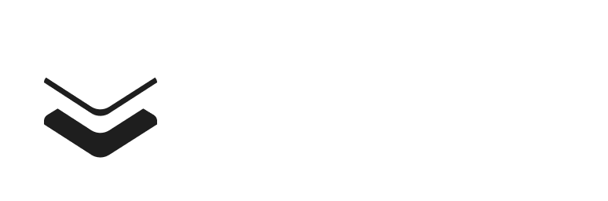

*This project is one of three parts in master project by Ole Mathias Ornæs*

# Wodge

Wodge is a web-framework, built to comply with NIS2 regulation through its internal component classification and recommendation system. Wodge is designed to be deployed with gaffa, but can also be used as a standalone application. It is built on top of React Router v7, vite, gin, and relies on frontend services like framer, d3, tailwind, rive, ++, depending on what sort of application you are making. The components are customized to align with NIS2 in terms of loggin and survailance. 

For Auth, we include several recommendations for building together with gaffa, but you're open to use whatever you want in other distributions.

The goal is to make the entire development experience of building web-artifacts similar to Nest workflow, except using different abstractions that we think is more usable. 

### Features include
- Component library.
- Fully customizable UI elements. 
- React-like component experience.
- API system. 
- Direct support for Redis, RabbitMQ, Qast, Postgresql and Firebase as services.
- Service acceptance list (you can make your own bridges to microservice on this list; contact us to update recommended services [will be alloed in gaffa if true, and not complain in wodge])

### Stack
- Go/Gin
- Typescript/Javascript
- React