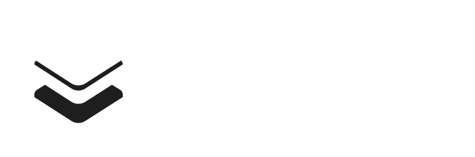

*This project is one of three parts in master project by Ole Mathias Ornæs*

# Wodge

Wodge is a web-framework, goal of this app is to easily be able to make web-applications that are compliant with NIS2 regulation. Wodge does three things:
1. Is a backend server, which stores interfaces with databases and other service. 
2. Orchestrates frontend applications, it allows you to create new apps with the wodge template, meaing it includes libraries and tools that have been tested based on usability and security. 
3. Is a component library. This part was inspired by Nist and Shadcn. You can add prebuilt components that simply work to quickly replicate features.

Wodge can be used as a standalone application, or as a library. It is built on top of React Router v7, vite, gin, and relies on frontend tools that are picked for utility, such as framer, d3 and tailwind depending on what sort of application you are making **more to be added**.

For Auth, we include several recommendations for building, but you're open to use whatever you want in other distributions.

### Features include
- Component library.
- Fully customizable UI elements. 
- React-like component experience.
- API system. 
- Direct support for Redis, RabbitMQ, Qast, Postgresql and Firebase as services.
- Service acceptance list (you can make your own bridges to microservice on this list; contact us to update recommended services [will be alloed in gaffa if true, and not complain in wodge])

### Stack
- Go/Gin
- Typescript/Javascript
- React